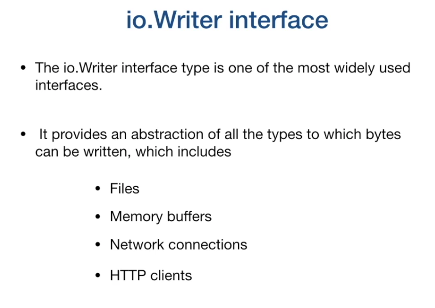

__CONCURRENCY__

**MOTIVATION**

- This is about multiple things happening at the same time at a **random** order.
- Go has a built in support for concurrency.
- It is about dividing the problem into multiple independant components.
- **PARALLELISM** The ability to execute multiple computations simalteneously


- In order to run application fatser we need to divide application into multiple independent units and run them in parallel.
 ***

**PROCESSES AND THREADS**
- The job of the OS is to give a fair chance to all processes access to the CPU memory and other resources.
- A **PROCESS** is an instance of a running program.
- A process provides an environment for a program to run.


- **THREADS** are the smallest unit of execution that a CPU accepts.
- Each process has at least 1 thread which is the main thread
- A process can have multiple threads
- Threads share the **SAME ADDRESS SPACE**
- Each thread has its own stack


  
- Threads run independant of each other.
- OS scheduler makes scheduling decisions at a thread level, not process level.
- Threads can run concurrently or in parallel.

THREAD STATES


LIMITATIONS
- Context switches are expensive.
- CPU has to spend time copying the context of the current executing thread into memory and storing the information of the next thread.
- Context switching is expensive per process level
- **C10k PROBLEM** 
    - Processor allocates a process a time slice for execution on a CPU core
    - Time slice is equally divided among the threads
    


- The more the amount of threads to switch, the more time the CPU uses in context switching.
- To do any meaningful job, a thread needs at least **2ms**
- **FIXED STACK SIZE**
    - Threads are allocated fixed stack size - _(could be 8MB)_
    - This limits the number of threads we can create.
  
```shell
ulimit -a # To get system information
```

WHY IS CONCURRENCY HARD


***

__GOROUTINES__

- Concurreny in GO is based on the paper [COMMUNICATING SEQUENTIAL PROCESSES](https://cs.stanford.edu/people/eroberts/courses/soco/projects/2008-09/tony-hoare/csp.html) by _Tony Hoare_
- Its based on 3 core ideas
    - Each process is built for sequential execution
    - Data is communicated between processes. (No shared memory)
    - Scale by adding of the same type.
    
- The tools that are usecd to achieve this are
    - Goroutines
    - Channels - Communicate data between goroutines
    - select - This is used cto multiplex the channels
    - sync package - Provides classical synchronisation tools
    
- **Goroutines** are user space threads managed by the go runtime.
- They are extremely light weight and start with 2KB of stack which grows and shrinks as required
- Very low CPU overhead
- Can create hundreds of thousands of goroutines in the same address space.
- channels are used for the commuication of data.
- Context switching is much cheaper
- Go-runtime creates OS threads
- Goroutines operate in the context of an OS thread.

***

- We need to make the main function that calls a go routine wait for the routine to finish execution.

_example - TCP client/server setup_

SERVER
```go
func main(){
	//Creates a listener for incoming server requests.
	listener, err := net.Listen("tcp", "localhost:8080")
	if err != nil{
		log.Fatal(err)
	}
	for {
		conn, err := listener.Accept()
		if err != nil{
			continue
		}
		go handleConn(conn)
	}
}
//Handles the incoming connections
func handleConn(c net.Conn){
	defer c.Close()
	for {
		_, err := io.WriteString(c, "Response from server\n")
		if err != nil{
			return
		}
		time.Sleep(time.Second)
	}
}
```

CLIENT
```go
func main(){
	// Dials into the TCP server
	conn, err := net.Dial("tcp", "localhost:8080")

	if err != nil{
		log.Fatal(err)
	}
	defer conn.Close()
	mustCopy(os.Stdout, conn)
}

//Outputs to the desired Writer. e.g (stdOut)
func mustCopy(dst io.Writer, src io.Reader){
    if _, err := io.Copy(dst, src); err != nil{
        log.Fatal(err)
    }
}
```

**Waitgroups**
- Race condition occurs when order of execution is not garanteed.
- Concurrent programs dont operate in a sequencial manner.
- We can create some determinism into the program by using waitgroups.
- Go follows concurrency model called **fork and join**


- We can utilise waitgroups to wait for the routine to finish before more checking values

  
- **defer** keyword ensures that a call is executed at all possible exits of a function. e.g interupts.
- `wg.Wait` is a blocking call.
- Call to `wg.Done` decreases the counter by 1.
- The `wg.Add` call should at least appear once outside the closure to ensure the call to `wg.Wait` is not executed before the closure begins execution.

**Goroutines and Closures**
- Goroutines operate within the same address space as they are created.
- They **can** directly modify variables in the enclosing lexical block
- Goroutines operate on the **current** value of the variable at the time of execution. So we need to be careful of the lexically scoped variables.

**Go Scheduler**
- This is part of the go runtime
- It is known as the **M:N Scheduler**
- It runs in the user space
- Go runtime creates the number of OS worker threads equal to GOMAXPROCS
- **GOMAXPROCS** Default value is the number of processors on the machine.
- Go scheduler distributes runnable goroutines over multiple worker OS threads.
- As of GO 1.14, go scheduler implements **asynchronous preemption**
- This prevents long running goroutines from hogging onto CPU which could block other goroutines.
- Asynchronous preemption is triggered based on a time condition. When a goroutine is running for more than 10ms, go will attempt to preempt it.
- Goroutines also have states same as threads.


**Context Switching**
- What happens when goroutine makes a synchronous system call?
- This can be a read/write to a system file.
- The system call waits for IO operation to be completed.
- OS thread is moved out of the CPU to waiting queue for I/O to complete.
- Synchronous system calls can reduce parallelism


- Go runs on the logical processor M1 and when it runs into a blocking I/O call it detaches `P` and attaches it and moves it to the new thread.


- When `G1` is done it is rejoined to the queue moved to `M2`


- What happens in general when asynchronous system calls are made
  - When the file descriptor is set to none-blocking
  - if file descriptor is not ready.
  
- Application complexity is increased - Set up loop callbacks.

**NETPOLLER**
- Netpoller is used to convert asynchronous system calls to blocking system calls.
- When a goroutine makes an async system call, and file descriptor is not ready, goroutine is parked at netpoller OS thread.
- Netpoller uses the interface provided by the OS to do polling on the file descriptors.
  - kqueue - macOS
  - epoll - linux
  - iocp - Windows
  
- Netpoller gets notified from OS when file descriptor is ready
- Netpoller notifies goroutine to retry operation
- Complexity of managing async system call is moved from application to Go runtime which manages it efficiently.

STEP 1


STEP2


**Work Stealing**
- This helps to balance the goroutines across all logical processors
- Work is better distributed and gets done more efficiently.
- If we have a balanced share of goroutines on logical processors and one gets done faster


- We can rebalance the work.
- If we still have goroutines in the global state which are runnable

The rules for work stealing are: If there are no routines in the local run queue:
- Try to steal from other logical processsors.
- If not found, check the global runnable queue.
- If not found check the netpoller.


__CHANNELS__

- They are used to communicate data between goroutines
- They are also used to synchronise execution in goroutines
- They are typed
- They are thread safe

```go
var ch chan <type>
ch := make(chan <type>)
```

- The pointer operator (`<-` or `->`) is used to send and receive the value from the channel.
- The arrow indicates the direction of the data flow.

```go
ch <- v // This is to send to a channel
v = <- ch //To receive from a channel
```

- Channels are blocking
- The sending goroutine is going to wait until there is a receiving goroutine
- The receiving goroutine is going to block until there is a value sent through the channel
- It is the responsibility of the channel to make the goroutine runnable again once it has data.
- Channels need to be closed to indicate that the sender does not have any more data to send through.

```go
close(ch)
```

- The receiver gets 2 values `value, ok = <- ch`
  - ok is true when the value is generated by a write
  - ok is false if value is generated by a channel close
  
**Range Buffered channels**
- Iterate over values received from a channel
- Loop automatically breaks when the channel is closed.
- Range does not return the second boolean value.

Unbuffered channels
- These are synchronous channels where reciever and sender block until the have required values.

Buffered Channels
- Channels are given capacity
- in-memory FIFO queue
- Async
- There is a buffer between the sender and receiver.
- The **sender** can keep sending values to the receiver until the buffer gets full and then it can block.
- The **receiver** can keep receiving the values without blocking until the buffer gets empty.
```go
ch := make(chan <type>, capacity)
```

**Channel Direction**
-  When using channels as function parameters you can specify if the channel is only meant to send or receive values.
- The specificity increases the type safety of the program.

```go
func pong(in <- chan string, out chan <- string){...}
```

**Channel Ownership**
- The dafault value of a channel is nil
- We should always initialise a channel with the **make** function 
- Closing a nil channel also causes a error.
- Owner of channel is the goroutine that **instantiates, writes and closes the channel.**
- Channel utilizers only have readonly view into the channel.
- This helps avoid deadlocks and panics
  - Deadlocking by writting to a nil channel
  - closing a nil channel
  - writing to a closed channel
  - closing a channel more than once.
  

**Deep Dive Channels**
- Internally channels are made of the `hchan` struct

  
- Hchan struct is protected by a mutex lock
- Goroutines copy elements into and from hchan

`Do not communicate by sharing memory, instead, they share memory by communicating.`
  
__SELECT__
- When G1 wants to receive results of computation from G2 and G3
- In what order are we ging to receive the results off these routines?
- Can we do the operation on the channel that is ready and not worry about the order.
- Select is like a `switch` statement


- Each case is not evaluated sequencially, all channel operations are considered simalteneously.
- Each case specifies communication.
- Select waits until some case is ready to proceed.
- If multiple are ready, it picks any one of them at random.
- Select is very helpful in implementing 
  - Timeouts
  - Non - Blocking communication
  - You can specify a timeout on a channel
  
```go
select{
    case v := <- ch: //statements
    case <-time.After(3 * time.Second): //Timeout here
}
```

- None blocking operations on the Select are achieved by specifying the default case.
- It does not wait for the channels on this case.
- The empty `select` statement would block forever
- Select on a nil channel will block forever.

__SYNC PACKAGE__

- When to use channels and when to use mutex?


- Mutex are used to protect shared resources.
- Provides exclusive access to a shared resource.
- Everytime a developer wants to perform an operation on a shared resource they must acquire a lock and release the lock when done.
- The region between a lock and unlock is called the **critical section**
- It is common to call unlock with defer

```go
defer mu.Unlock() //gets executed at the end of the function
```

- The `sync.RWMutex` - Allows for multiple readers, writers get exclusive lock.


**sync.Atomic**
- Low level atomic operations on memory
- Used by other synchronization utilities.
- It is a lockless operation

```go
atomic.AddUint64(&ops, 1)
value := atomic.LoadUint64(&ops)
```

**sync.Cond**
- A condition variable is one of the sychronization mechanisms.
- Its a container of goroutines waiting for a certain condition.
- Ensures that a goroutine suspends while waiting.
- We need a way to signal to the waiting goroutine that the condition has been met

```go
var c *sync.Cond
```

- We use the constructor `sync.NewCond()` to create a conditional variable which takes a `sync.locker` interface as input.
```go
m := sync.Mutex{}
c := sync.NewCond(&m)
```

- sync.Cond() contains 3 methods
  - **c.Wait()** - Suspends the execcution of the calling thread and automatically releases the lock. It does not return unless woken up by signal or broadcast. On resume it checks for the condition again before continuation.
    
  - **c.Signal()** - Wakes up one goroutine that was waiting on a condition. Finds the goroutine that has been waiting the longest and notifies that.
  - **c.Broadcast()** - Wakes up all goroutines that were waiting on c
  
**Sync.Once**
- Used to run one time initialization functions
```go
once.Do(funcValue)
```
- It ensures that only one call to Do everr calls the function passed in - even on goroutines.
- Very useful in the creation of **singleton** objects.

**sync.Pool**
- Commonly used to construct the creation of expensive resources like database connections, network connections and memory.
- We will maintain a pool of a fixed number of instances of those resources and thoses resources will be reused.
- If caller request, it checks the pool and if the resource is in the pool we return that resource.
```go
b := bufPool.Get().(*bytes.buffer)
```

- when finished with the usage the caller calls the `put` method to put back the resource in the pool.

```go
bufPool.Put(b)
```

__RACE DETECTOR__
- This is race condition detection in Go.
- Go provides a race detector tool for finding race conditions in Go code
- This tool is intergrated with other Go tools
- We use the option `-race`
- A race enabled binary can be 10 times slower and consume 10 times the memory.
- We can use this on integration tests and load tests.


__PIPELINES__

- They process streams or batches of data
- They enable efficient use of the IO and multiple cpu cores
- These are a series of stages connected by channels
- Each stage is represented by a goroutine
- A stage takes data in, performs an operation on it and send it out.
- By using pipelines we can separate concerns of each stage.
- This enables us to process individual stages concurrently.


  
- Stages could consume and produce the same types 
- This would enable the composibility of the pipeline.


We can see the an example of the practical use of a pipeline below.


- We can then scale up or down the individual stages depending on the need and time it takes to complete a computation.

**Fan-in and Fan-out**
- When a stage is computationally intensive
- Can we break up computationally intensive stage into multiple goroutines and run them in parallel.
- The term **fan-out** is used when we spin up multiple fo routines to handle the input from a channel.
- They would read the data from the same channel.
- The term **fan-in** is the opposite.
- Data is read for a **SINGLE** channel.


__CONTEXT PACKAGE__
- In a go server each incoming request is handled in its own goroutine
- The request handler can create further routines to handle items like database connections and rpc calls
- When a request is timed out or when a request has been cancelled by the user we need all the spun routines to stop as quickly as posible
- We need a way to propergate request scoped data down the call graph.
- We need a way to propergate cancellation signal
- The core of the `context` type has 4 components
  - Done() - returns a closed channel when context is cancelled
  - Err() - Indicates why this context was cancelled
  - Deadline() - returns time when this context will be cancelled
  - Value() - returns values associated with keys.
  


- The functions that are provided by the context package are as follows
  - Background() - Returns an empty context / is the root typically used by the main function - It is never cancelled
  - TODO() - Also returns an empty context. Its purpose is to serve as a placeholder.]
  
- Contexts are immutable, 
- Context package provides function to add new behavior
- To add cancellation behavior we have function like 
  - context.WithCancel()
  - context.WithTimeout()
  - context.WithDeadline()
  
- The child goroutines inherit these contexts to facilitate their behavior.
```go
ctx, cancel := context.WithCancel(context.Background())
defer cancel()
```

- The cancel function closes the done channel.


- A context with deadline passes the deadline into the context initialisation.

```go
deadline := time.Now().Add(5 * time.Millisecond)
ctx, cancel := context.WithDeadline(context.Background, deadline)
defer cancel()
```

- The done channel is closed when the machine's clock advances past the given deadline.
- The `*http.Request` already has a context that can be used.


- Any change to a context value creates a new context value.

__HTTP SERVER TIMEOUTS__
- Setting timeouts on server is important in ensuring the saving system resources and protection from DDOS attacks.
- File descriptors are limited,  a malicious user can open many client connections thereby consuming all file descriptors and server wont be able to serve new connections.
- There are 4 main timeouts on a server:
  - Read timeout - For request body, from when connection is accepted to when request body is fully read.
  - Read Header Timeout - Amount of time allowed to read request headers
  - Write timeout - sending the response to the client. Covers from time of end of request header read to end of response write.
  - Idle timeout. -  The max amount of time to wait for the next request when the **keep-alive** is enabled.
  


- Timeouts can be set explicitly using a server.
```go
svr := &http.Server{
	ReadTimeout:        1 * time.Second,
	ReadHeaderTimeout:  1 * time.Second,
	WriteTimeout:       1 * time.Second,
	IdleTimeout:        1 * time.Second,
	Handler:            serverMux,
}
```

- You need to set default timeouts when dealing with untrusted clients and networks.
- We also need to control the amount of time it takes for our handler functions to complete.
- The `net.http` package also provides a function `TimeoutHandler`
- It runs the input handler within the given time limit.


__INTERFACES__


- WE CAN HAVE COMPOSITE INTERFACES


- The stringer interface provides a way for types to control how their values are printed.

WE CAN USE TYPE ASSESSION TO GET CONCRETE VALUE FROM INTERFACE VALUE BY SPECIFYING THE EXPLICIT TYPE.

IT IS USED TO APPLY DISTINGUISHED OPERATIONS OF THE TYPE


EMPTY INTERFACES 

